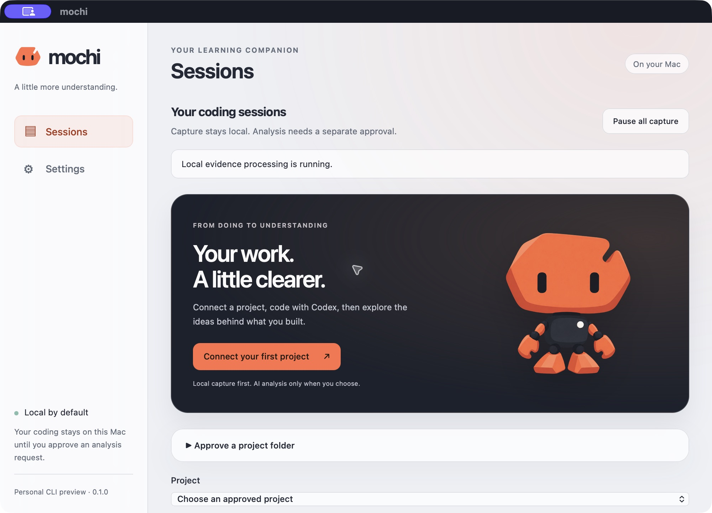
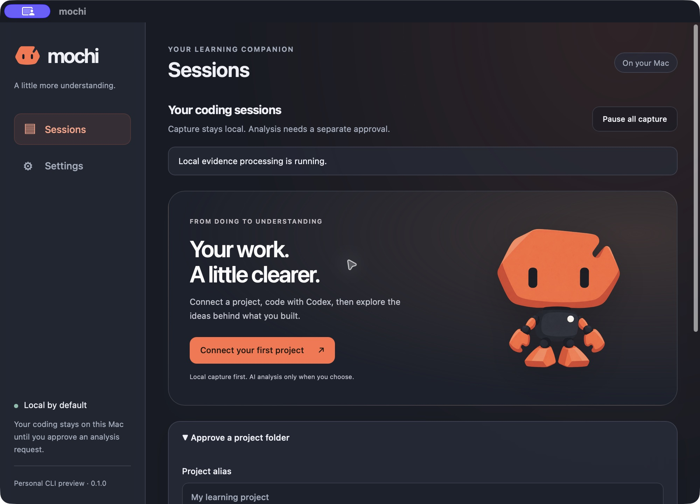

<p align="center">
  
</p>

<h1 align="center">mochi</h1>

<p align="center"><strong>Build with AI. Understand what you built.</strong></p>
<p align="center">A local-first desktop learning companion for your own coding work.</p>
<p align="center">macOS Apple Silicon · Codex CLI · Personal MVP preview</p>

## A little more understanding

mochi helps you look back at the work you build with Codex: capture an approved project locally, explore the observed changes, then choose whether to turn that evidence into an explanation and a short self-check.

Your sessions stay on your Mac. Remote analysis starts off, uses your own OpenAI API key in macOS Keychain, and requires approval of the exact request. No mochi account, cloud sync or telemetry service.

## Showcase

| Light                                                                                    | Dark                                                                                   |
| ---------------------------------------------------------------------------------------- | -------------------------------------------------------------------------------------- |
|  |  |

Native screenshots of the empty first-run interface. The Signal robot, app icon and understated glass surfaces are bundled locally; the optional floating character is currently a static trial.

## What works today

- **Connect deliberately.** Approve a project folder, review the exact Codex hook changes, then enable or pause local capture.
- **Look back locally.** Browse sessions, captured activity and filtered Git context, with missing evidence and uncertain attribution kept visible.
- **Choose what leaves your Mac.** Inspect a sanitized request before optional OpenAI analysis; storing a key never grants send permission.
- **Learn from your work.** Evidence-linked explanations focus on up to three concepts. Self-check answers and feedback are saved locally.
- **Make it yours.** Separate Sessions and Settings views, light/dark/system appearance, and explicit static-companion show/hide controls.

## Try the preview

Build from source on an Apple Silicon Mac using the prerequisites below:

```bash
pnpm install --frozen-lockfile
pnpm desktop:build
open target/release/bundle/macos/mochi.app
```

Start with a disposable project and follow the [personal trial guide](docs/implementation/INTERNAL_CLI_MVP.md). Capture/history do not require an API key. New explanations require your own OpenAI API key and separately billed API usage.

**This is an engineering preview, not a finished V1 release.** Codex CLI **0.151.0** is the verified installation baseline; Desktop capture remains partial. The complete new live CLI → OpenAI → learning trial and human model-quality review are still pending. Mini challenges, knowledge tracking, spaced review, companion animation and distribution signing/notarization are future work. Local storage relies on account permissions rather than application-level encryption.

The checkpoint passed **144 Rust tests and 43 frontend tests**, plus all nine repository gates on macOS Apple Silicon. See [validation evidence](docs/implementation/UI_FINALIZATION.md) for the tested boundaries, intermittent helper-fixture timing and remaining native gates.

Built with **Tauri 2, React, TypeScript, Rust and bundled SQLite**. [Roadmap](docs/implementation/V1_ROADMAP.md) · [Architecture](docs/architecture/ARCHITECTURE.md) · [Privacy](docs/security/PRIVACY_SECURITY.md)

## Development

Use an Apple Silicon Mac, Node **24.12.0** (`.node-version`), pnpm **11.19.0** (`packageManager`), and Rust **1.98.1** with rustfmt/Clippy (`rust-toolchain.toml`). Install pnpm using its official installation instructions and Rust using rustup; put both on PATH. Install Xcode and select its developer directory (`xcode-select -p` should point to the installed Xcode). See [Tauri prerequisites](https://v2.tauri.app/start/prerequisites/). The configured macOS deployment floor is 12.0; minimum-OS and clean-machine compatibility remain unverified.

From the repository root:

```bash
pnpm install --frozen-lockfile
pnpm dev
```

The development app opens the **Sessions** view. Open **Settings → About this preview → Check desktop connection** to verify the Rust IPC response. Quit the app or press Ctrl+C in the terminal to end development. Port 1420 must be available. `pnpm dev:web` starts the browser preview without native IPC; this is a development aid for the desktop frontend.

| Command                             | Purpose                                                                |
| ----------------------------------- | ---------------------------------------------------------------------- |
| `pnpm dev` / `pnpm desktop:dev`     | Start the native Tauri development app and Vite                        |
| `pnpm dev:web`                      | Start the frontend preview on loopback port 1420                       |
| `pnpm typecheck`                    | Strict TypeScript checks for all packages and build/test configuration |
| `pnpm test`                         | Frontend tests and Rust tests                                          |
| `pnpm lint`                         | ESLint and Clippy, warnings treated as errors                          |
| `pnpm format` / `pnpm format:check` | Prettier and rustfmt; master docs retain their original layout         |
| `pnpm check:rust`                   | Compile-check every native target                                      |
| `pnpm build`                        | Typecheck and build frontend assets                                    |
| `pnpm desktop:build`                | Build the native release binary and local macOS `.app`                 |

Capture-focused Rust commands:

```bash
cargo build -p mochi-hook --release --locked
cargo test -p mochi-capture --locked
target/release/mochi-hook inspect
```

Domain-focused checks:

```bash
cargo test -p mochi-domain --locked
pnpm test:frontend
```

Persistence-focused checks:

```bash
cargo test -p mochi-persistence --locked
```

Assembly-focused checks:

```bash
cargo test -p mochi-assembly --locked
```

Integration-detection checks:

```bash
cargo test -p mochi-integration --locked
```

Brief 08 also adds explicit developer commands `connect`, `disconnect`, and `rollback-integration`, requiring an exact displayed approval token. They are not automatic production setup. See the [installer report](docs/implementation/CODEX_INTEGRATION_INSTALLER.md) before using them; do not point test flows at an unapproved project or user configuration.

The legacy developer helper spool is `~/Library/Application Support/dev.mochi.desktop/capture/v1/spool`. The app uses a separate `capture-v2-spool` inside Tauri app data and never imports the legacy spool automatically. Authorized production capture obtains the approved root, spool and revision from current private policy; `--spool-root` belongs to the legacy isolated developer flow. Hook trust remains a manual Codex review; installation can use the explicit Brief 08 flow. Never replace an existing hook file wholesale.

Focused commands: `pnpm test:frontend`, `pnpm test:rust`, `pnpm lint:frontend`, `pnpm lint:rust`. Rust checks require the native prerequisites; run `pnpm build` before direct release-mode Cargo commands so embedded frontend assets exist. Normal `desktop:build` handles this automatically.

Local output: `apps/desktop/dist/`, `target/debug/mochi-desktop`, and `target/release/bundle/macos/mochi.app`. These are ignored. The local app bundle is not a signed/notarized distribution release. CI checks frontend tooling on Ubuntu and native compilation, tests and `.app` building on macOS; it does not prove integration or clean-machine installation.

## Repository layout and ownership

```text
apps/desktop/
  src/                    Project/session and internal learning controls; typed IPC
  src-tauri/              Rust entry points, commands, Tauri configuration/capabilities
apps/mochi-hook/          Standalone trusted-hook bridge and developer inspector
crates/capture/           Provider adapter, normalized ingress, sanitizer, spool, Git context
crates/privacy/           Shared file and path policy
crates/domain/            Authoritative provider-independent coding-session model
crates/persistence/       SQLite migrations, ingress/project/session repositories
crates/assembly/          Deterministic persisted-evidence to CodingSession assembly
crates/integration/       Read-only detection and preview-approved owned hook installer
crates/bridge/            Current consent, helper policy, import and Git coordination
crates/learning/          Analysis/reference/ranking/self-check validation and grading
packages/domain/          Readonly matching TS contracts, parser, helpers, shared fixtures
packages/ui/              One reusable presentation wrapper; no native access
docs/                     Authoritative product and architecture specifications
.github/workflows/ci.yml  Frontend and native foundation checks
Cargo.toml                Rust workspace; root Cargo.lock pins dependency resolution
```

Rust owns native integration, privacy, persistence and deterministic learning behavior. `crates/integration` owns the generic read-only detection contract and Codex-specific native detector. `crates/privacy` owns the shared file/path decision contract. `crates/domain` owns validated domain invariants; React consumes narrow IPC, while domain TypeScript holds checked matching contracts and pure helpers. `crates/persistence` owns bundled SQLite, migrations, policy-checked evidence import, replay tombstones, and validated session repositories. `crates/assembly` owns deterministic evidence interpretation and delegates its atomic write to persistence. The core runs bounded import/assembly for already authorized production capture, while the separate analysis service requires exact explicit send approval. Internal learning controls are implemented; knowledge/review and full V1 screens remain future work.

## Product boundaries

- One desktop app contains capture, analysis, learning, knowledge, review, and settings.
- macOS Apple Silicon is the first release target.
- Codex is the only V1 coding-session source; internal contracts are provider-agnostic.
- SQLite is the local source of truth. Remote analysis is optional and requires separate consent.
- OpenAI is the first analysis adapter, using a user-supplied API key in macOS Keychain.
- No account backend, cloud sync, web learning platform, billing, or website dependency in V1.
- Passive capture currently has a conditional prototype basis: CLI is supported and Desktop is partial with prompt/interrupt capabilities marked unknown.

## Read in this order

| Document                                                          | Purpose / authority                                          |
| ----------------------------------------------------------------- | ------------------------------------------------------------ |
| [AGENTS.md](AGENTS.md)                                            | Rules for implementation tasks                               |
| [Product specification](docs/product/V1_PRODUCT_SPEC.md)          | Product promise and release requirements                     |
| [V1 scope](docs/product/V1_SCOPE.md)                              | Included, excluded, and conditional capabilities             |
| [User journey](docs/product/USER_JOURNEY.md)                      | End-to-end behavior and recovery paths                       |
| [Decisions](docs/product/DECISIONS.md)                            | Established decisions, specified defaults, feasibility gates |
| [Architecture](docs/architecture/ARCHITECTURE.md)                 | Component boundaries and runtime ownership                   |
| [Session event schema](docs/architecture/SESSION_EVENT_SCHEMA.md) | Canonical ingestion contract                                 |
| [Data model](docs/architecture/DATA_MODEL.md)                     | Persistence, transactions, provenance, deletion              |
| [Persistence report](docs/implementation/SQLITE_PERSISTENCE.md)   | Implemented SQLite boundary and verification                 |
| [Assembly report](docs/implementation/SESSION_ASSEMBLY_ENGINE.md) | Implemented evidence interpretation and traceability         |
| [Privacy and security](docs/security/PRIVACY_SECURITY.md)         | Consent and data lifecycle                                   |
| [Learning model](docs/learning/LEARNING_MODEL.md)                 | Evidence-grounded analysis and assessment                    |
| [Knowledge model](docs/learning/KNOWLEDGE_MODEL.md)               | Deterministic state and review rules                         |
| [V1 UX](docs/design/V1_UX.md)                                     | Screens, states, accessibility, native behavior              |
| [Roadmap](docs/implementation/V1_ROADMAP.md)                      | Dependency-ordered briefs 00–38                              |
| [Brief template](docs/implementation/BRIEF_TEMPLATE.md)           | Contract for individual implementation tasks                 |
| [Validation plan](docs/implementation/VALIDATION_PLAN.md)         | Release acceptance and meaningful verification               |

## Personal preview interface

The personal CLI checkpoint now has a glassmorphism Sessions/Settings shell using the selected Signal mark, static character and app icon. Application branding is lowercase `mochi`. Settings includes a window-local System/Light/Dark appearance choice, Keychain/remote controls and the optional static companion. Navigation preserves session drafts; browser rendering is a labelled appearance preview with native actions disabled. See [interface finalization](docs/implementation/UI_FINALIZATION.md) for checks and remaining gates.

## Next task

Complete the personal synthetic CLI/BYOK trial in [the MVP guide](docs/implementation/INTERNAL_CLI_MVP.md), including human model-quality review. The next product implementation is Brief 22 (text-only mini challenge), followed by the existing knowledge/review sequence. The current checkpoint does not satisfy full V1 ready-lesson or distribution acceptance. Do not implement further roadmap work without an explicit task.

## Documentation maintenance

The user selected the orange/graphite **Signal** robot. [Mochi identity](docs/design/MOCHI_IDENTITY.md) includes the final logo, macOS icon, monochrome menu-bar mark and static character; the app now uses the Signal icon. [Brand brief evidence](docs/implementation/MOCHI_BRAND_IDENTITY.md) tracks validation. [Companion 01](docs/implementation/COMPANION_STATIC_TRIAL.md) adds the separate static floating-window trial with explicit show/hide controls. Animation, saved preferences and background/menu-bar lifecycle remain a subsequent brief, independent of the CLI MVP.

For an isolated native visual preview, run `MOCHI_COMPANION_PREVIEW=1 pnpm desktop:dev`, or after `pnpm desktop:build`, run `MOCHI_COMPANION_PREVIEW=1 target/release/bundle/macos/mochi.app/Contents/MacOS/mochi-desktop`. This mode loads a synthetic preview directly and skips capture/database/analysis startup. Drag the character; click it to reopen the preview window. Close hides the preview window; Command-Q quits the trial. Normal app startup keeps the companion hidden, and closing the normal main window still exits the app.

Technical identifiers and documents use English; initial product UI is English. Localization is deferred. Each specialized spec names its authority. Keep shared terms, limits, statuses, consent, and brief dependencies aligned. Record changes in [DECISIONS.md](docs/product/DECISIONS.md), update affected documents in the same change, and run the documentation checks in [VALIDATION_PLAN.md](docs/implementation/VALIDATION_PLAN.md).

Desktop/Codex-only decisions supersede earlier website, multi-provider and percentage-based knowledge sketches. Concrete defaults added to make this pack implementable are distinguished in the decision register.
