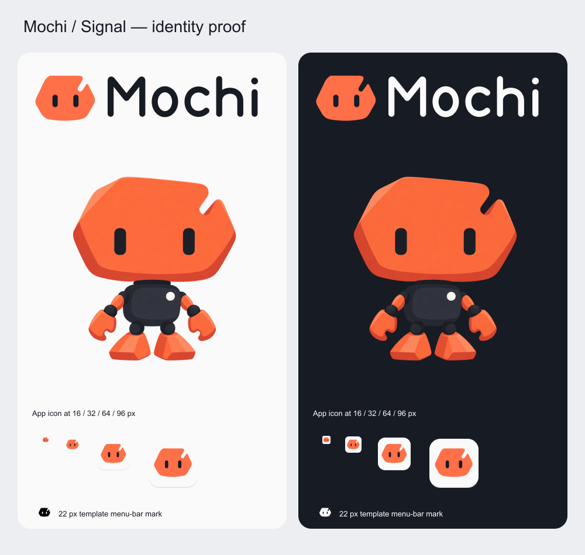
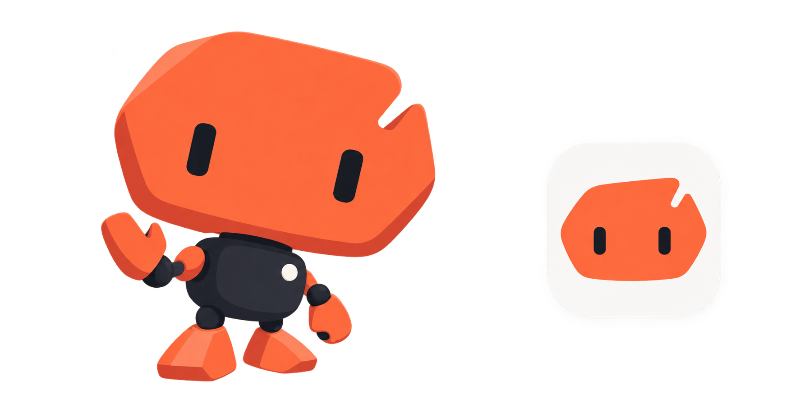
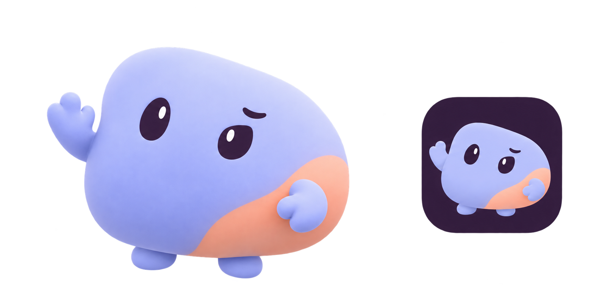
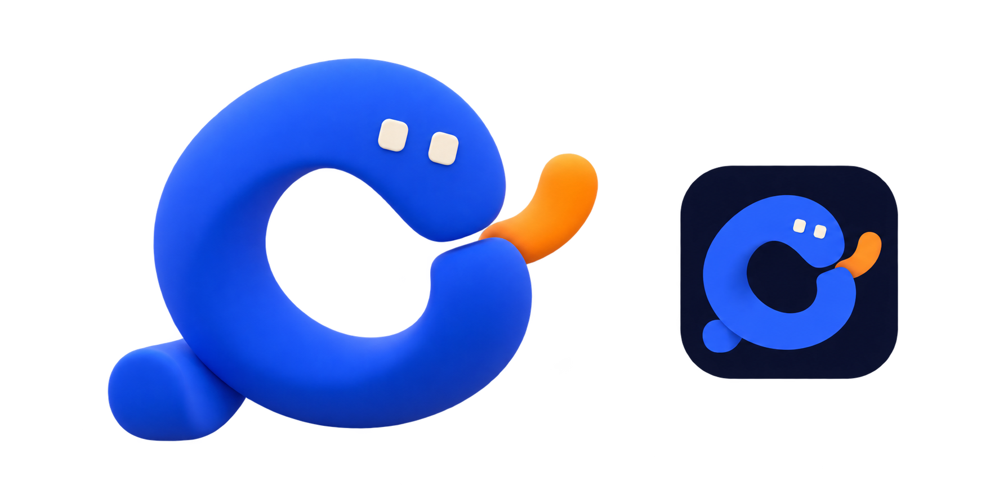
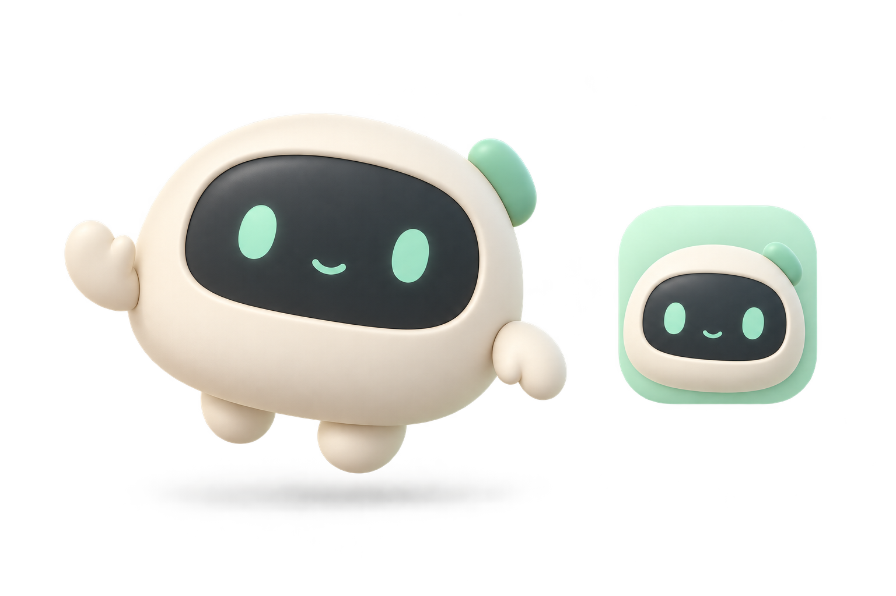
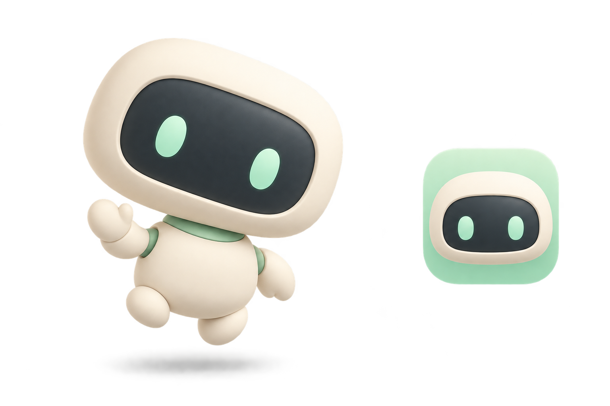
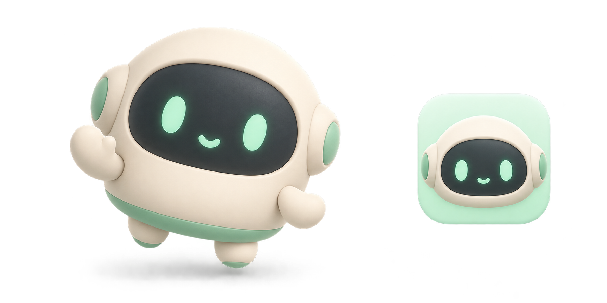

# Mochi identity

Decision date: 2026-10-01. Authority: visual identity. Product boundaries remain in [V1 scope](../product/V1_SCOPE.md); native behavior remains in [V1 UX](V1_UX.md). Execution and acceptance are tracked in [Brand brief](../implementation/MOCHI_BRAND_IDENTITY.md).

## Application lettering amendment — 2026-10-02

The user requested lowercase **mochi** throughout the UI. The application now uses the selected Signal mark alongside lowercase live text, including its isolated companion preview. The existing capitalized vector/PNG wordmarks and proof remain historical design exports, rather than UI assets. App-icon/character geometry and the final asset manifest are unchanged. Glass surfaces retain the selected coral/graphite/paper identity; see [current UI evidence](../implementation/UI_FINALIZATION.md).

## Selected identity — Signal

The user selected **Round 02 / A — Signal** on 2026-10-01. Mochi uses the orange/graphite geometric robot: a softly angular helmet with an upper-right notch, two vertical eyes directly on the coral face, a small graphite body and orange hands/boots. The static character keeps the selected concept's graphic 2.5D rendering. The simpler flat helmet mark supplies the logo, app icon and menu-bar template.

Final palette: coral `#FF7048`, graphite `#171B24`, paper `#FAFAFA`. The exact word **Mochi** is drawn from original outlined/stroked vector glyphs; no font dependency is embedded or required.

Final sources and exports are under [final/](assets/mochi/final/). [manifest.json](assets/mochi/final/manifest.json) records dimensions and checksums. [proof.html](assets/mochi/final/proof.html) is a local static design proof, not a website or application UI.

- [Robot-face mark](assets/mochi/final/mark.svg), monochrome variants and separate wordmarks.
- [Light-background logo](assets/mochi/final/logo-light.svg), [dark-background logo](assets/mochi/final/logo-dark.svg), both monochrome variants and high-resolution PNG exports.
- [App-icon vector master](assets/mochi/final/app-icon.svg), PNGs from 16 to 1024 pixels and [macOS ICNS](assets/mochi/final/app-icon.icns).
- [Menu-bar template SVG](assets/mochi/final/menu-bar.svg), 22/44-pixel PNGs with transparent eye holes. Native integration must use template rendering.
- [Static idle character](assets/mochi/final/character-idle.png), 1254×1254 RGBA; generated with the built-in tool using the selected sheet and [exact edit prompt](assets/mochi/final/character-prompt.json).

The app's foundation M icon has been replaced with the selected Signal app icon. The mascot remains a static asset; floating-window, animation and lifecycle behavior are subsequent briefs.

Rebuild vector sources with `node tools/brand/build-assets.mjs`. Export reproduction details are in [brand tools](../../tools/brand/README.md).

## Second-round alternatives

The user asked to compare a robot, an organic mochi creature and an abstract mascot, with a distinctive, cool developer-brand feel and a small amount of playfulness. Signal was selected; Mallow and Loop remain unused alternatives.

### Round 02 / A — Signal

Coral-orange and graphite robot with a notched helmet silhouette and eyes directly on the face. More geometric and graphic than the rejected round; the generated render adds depth beyond the requested flat illustration.

### Round 02 / B — Mallow

Asymmetric periwinkle mochi creature with a peach patch, plum eyes and a small expressive eyebrow. Organic body, no robot display; the icon uses a dark plum background.

### Round 02 / C — Loop

Cobalt open-loop mascot with ivory eyes and an orange terminal. A sculptural abstract character that can also become a simplified mark. Its silhouette reads as a C-like loop; test whether that association fits Mochi before selecting it.

Exact second-round prompts are in [round-02/prompts.json](assets/mochi/concepts/round-02/prompts.json). All sheets are 1774×887 RGBA with actual transparency. These remain concept previews: inspect and regenerate cutout edges, simplify icons at small sizes, and decide final materials/geometry after feedback. In particular, the Signal icon has an unwanted edge halo.

## First direction — superseded

The user rejected all three first-round concepts and the cream/mint color combination on 2026-10-01. Keep this round as exploration history only. Character form, palette and rendering style are open again; do not derive final assets from these sheets. The stationary companion behavior remains the agreed native target.

Mochi is a calm learning companion for developers who use AI to build and want to understand their work. Its identity is a soft, matte 3D/clay chibi robot: warm cream shell, dark graphite face, restrained mint accents, simple expressive eyes, small hands for waving and a squashable body. No guilt, gamification, fake learning status or busy decoration.

The logo combines a simplified robot-face mark with the exact word **Mochi**. The app icon and desktop character share the selected face and silhouette. The clay rendering is for the mascot; the final logo must have a clean editable vector source, rather than an embedded raster illustration.

Palette starting points: cream `#F7F3E8`, graphite `#263339`, mint `#91D5B6`. Generated renders may vary with lighting; these values are design references, not sampled final artwork colors.

## Rejected first-round concepts

All three concept sheets were generated with the built-in `image_gen` tool and `transparent_background: true`. Each pairs a full-body character with an app-icon study. They are exploration images, not production assets. No concept has been selected automatically.

### A — Pebble

Compact single-body robot with a mint side tab, small hands and feet, and a smiling display face. The side tab gives the silhouette a recognizable feature.

### B — Capsule

Oversized rounded head above a small body, mint collar and quiet display face. Strong chibi proportions and an articulated head for tilting.

### C — Dumpling

Rounded mochi body with small side ears, mint lower rim and a happy face. The most organic silhouette of the three.

Exact generation prompts are recorded in [prompts.json](assets/mochi/concepts/prompts.json). The sheets have real RGBA transparency, but A/B contain a broad decorative glow, C has visible edge artifacts, and their canvas sizes differ. Regenerate the selected character as an isolated production cutout, remove decorative glow, and verify clean edges on light/dark backgrounds before integration. Do not treat the preview icon as a finished small-size icon.

## Final asset requirements

- Selected character reference and isolated transparent character PNG, suitable for approximately 120-point desktop display at Retina scale.
- Editable vector robot-face mark and Mochi wordmark, combined and separate, with light/dark and monochrome variants. Outline final lettering so rendering does not depend on installed fonts.
- Square app-icon master, high-resolution PNG and macOS ICNS derived from the selected identity; simplify features for 16–32-pixel legibility.
- Monochrome template menu-bar icon with usable contrast in macOS light/dark appearances.
- Versioned manifest identifying final assets, dimensions and source prompts. Store assets in the repository before consumers reference them.

Signal was selected and final static assets were created after that selection. The scaffold icon was replaced after visual inspection. Runtime animation belongs to a later companion brief.

## Desktop character behavior selected by the user

The optional character stays where the user places it. It gently floats and blinks. New pointer entry plays one of three short reactions in order: wave, squash-and-spring, smiling head tilt. Remaining hovered does not retrigger; running animations do not accumulate a queue. Dragging changes position without opening the app; a click opens the existing main window.

It appears above ordinary windows, remains hidden in fullscreen workspaces, and supports reduced motion. Initial enablement is opt-in. Position persists locally; disconnected displays cause safe repositioning. These behaviors are planned, not implemented by this concept checkpoint.

Distribution is planned through a future download website, not the Mac App Store. Mochi itself remains a local desktop application. Website implementation, signing/notarization, update delivery and publication are separate work.
