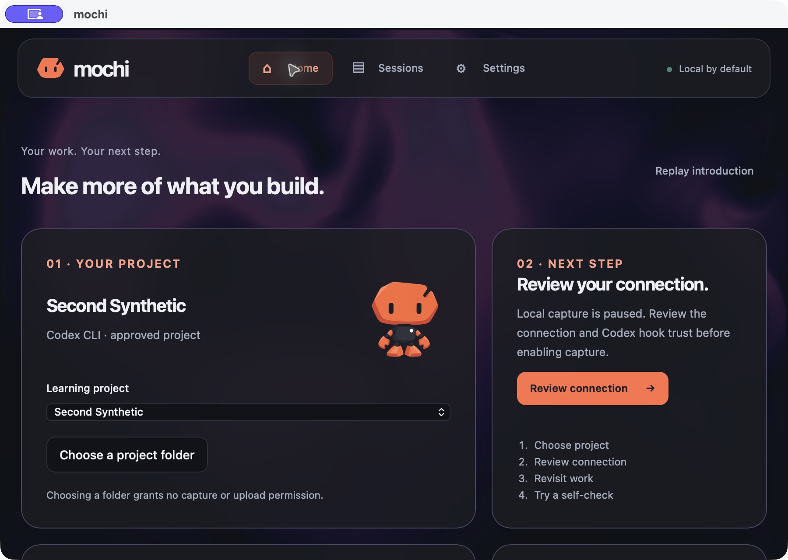
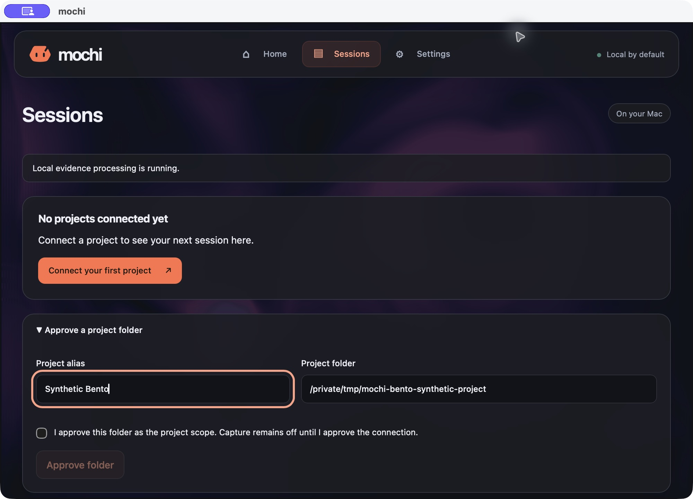
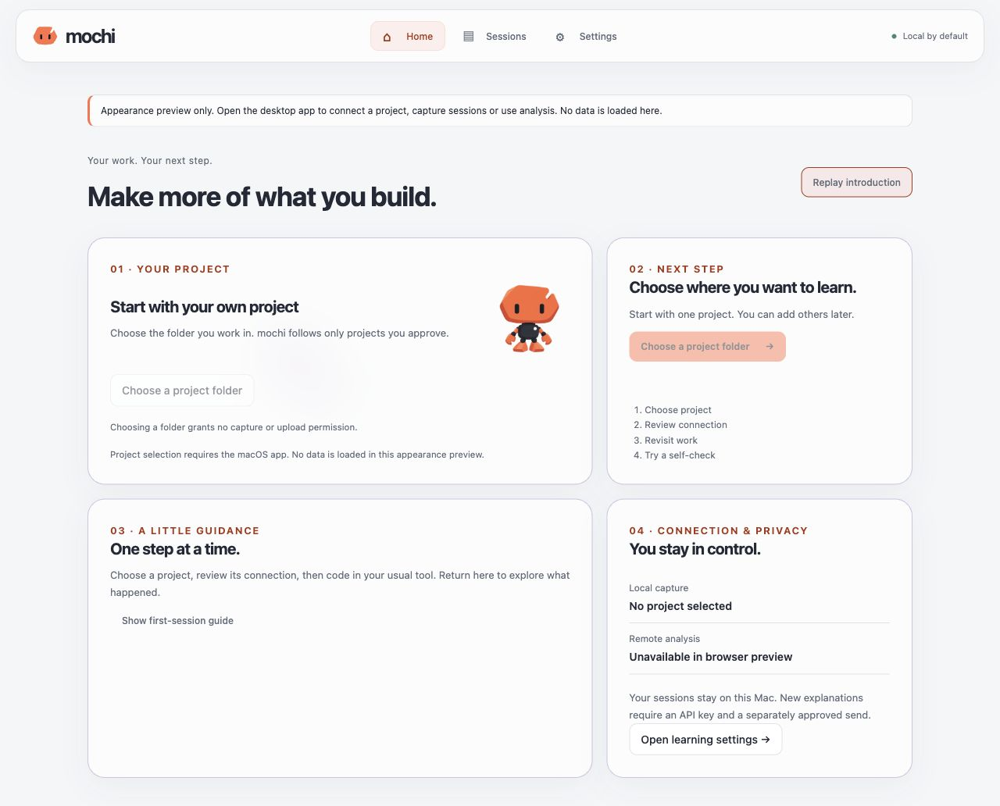

# Bento Home implementation - 2026-10-03

Status: bounded Home/project-entry milestone implemented. Assignment:
[BRIEF_BENTO_HOME](BRIEF_BENTO_HOME.md). This supersedes only the guided trial's
post-tour guide and Welcome's window-local completion limit.

## Delivered behavior

Welcome and the four manual introduction slides remain, with replay from Home.
Four Bento cards show approved project selection, one next step, help/latest
session, and separately labelled local capture and remote analysis. Native
single-folder selection creates only a memory draft with an editable alias and
explicit source choice. A matching already-approved path selects its retained
project directly. Other folders route to existing Sessions approval with alias
focus and unchecked scope/capture consent. Desktop, Claude Code and Cowork stay
visible as unavailable choices with a return/tool-change path.

The next action uses typed local state: no project, draft/source, paused
tracking, no recorded session, partial/open session, analysis prerequisites,
analysis running, insufficient context, stale explanation, or a current saved
internal explanation/self-check. Home never installs, enables tracking or sends
analysis. Capture enabled without a session never claims a verified connection.
Existing local connection/trust and exact remote-send approvals remain intact.

`useLocalWorkspace` shares bounded paginated reads and selection between mounted
Home and Sessions. Its one three-second main-window-active refresh coalesces
requests and rejects old generations/selection epochs. Detail, connection
previews and history pagination also reject a late old-project result, including
an A-to-B-to-A switch. Navigation carries UUIDs and an explicit focus target;
new paths/aliases stay in memory. Existing exact preview and answer drafts remain
mounted across navigation. Successful folder approval clears the Home draft.

Rust owns the main-window-only picker, backed by pinned Tauri dialog 2.7.1;
[official API](https://v2.tauri.app/plugin/dialog/) documents Rust dialog usage.
This is the only role of the added dependency. No frontend dialog/filesystem
capability is granted. It returns one folder or null on cancellation, with a
single-dialog lease and bounded safe path validation. Existing canonical-root
approval remains authoritative; there is no project/history discovery.

Private `home-preferences-v1.json` stores exactly `schemaVersion: 1`,
`homeReached` and optional approved `projectId`. Rust validates retained UUIDs,
strict bounded input, owner permissions and regular-file/link constraints;
writes use a private temporary file, sync and atomic rename. No SQLite migration,
path, credential, consent or connection-success flag. Deleted selection is
reconciled against authoritative projects. Read/storage errors are explicit;
preference errors are nonblocking notices about possible restart reset.

## Automated verification

All required repository commands were run on macOS arm64:

| Command | Result |
| --- | --- |
| `pnpm typecheck` | Pass |
| `pnpm lint:frontend` | Pass |
| `pnpm test:frontend` | 98 tests pass in 17 files |
| `pnpm build` | Pass, including frontend production assets |
| `pnpm test` | Pass for combined frontend/Rust; see scheduling note below |
| `pnpm lint` | Pass, including strict workspace Clippy |
| `pnpm format:check` | Pass |
| `pnpm check:rust` | Pass, all targets |
| `pnpm desktop:build` | Pass, local arm64 macOS app bundle |

Rust suite: 151 passed, one preexisting intentionally ignored native Keychain
write/delete test. Home adds three Rust preference tests for restart/private
metadata, malformed/oversized schemas and unsafe file/link rejection.
Frontend coverage includes initial entry, skip/replay, preferences/restoration,
deleted project, safe read/save/picker errors, cancel, unavailable tools,
focused unchecked Sessions prefill, draft/preview preservation, old-response
races, inactive polling, partial capture, key/remote prerequisites, stale/current
explanations, insufficient context and targeted session focus.

Scheduling note: one earlier full parallel run passed; subsequent runs saw
intermittent existing installer `HelperUnavailable` failures for shell fixtures.
The complete Rust suite passed with `RUST_TEST_THREADS=1 pnpm test`, without
changing installer behavior or its safety deadlines. The final frontend-only
rerun includes the last navigation and approved-folder regression tests. An
earlier concurrent native build/doc-test artifact mismatch was resolved by
isolated test execution. No fixture result is treated as live capture/model proof.

The existing Liquid Ether split chunk remains about 531 kB and produces Vite's
size advisory. This task adds no GSAP or new frontend renderer dependency.

## Native macOS inspection

Used an isolated `dev.mochi.bentoqa20261003` app profile and disposable synthetic
folders under `/private/tmp`; no user project, key or transcript was used.
Tracking stayed paused and remote analysis off. No hook was installed, Codex
trust changed, coding turn captured or model request sent.

| Scenario | Observed result |
| --- | --- |
| New profile | Welcome, Get Started and four manual slides; Skip opens Bento |
| Native folder picker | Actual macOS one-directory sheet; cancel retains state |
| Tool choices | CLI route works; Claude unavailable, choose-another recovery works |
| Sessions prefill | Alias/path match chosen folder; alias focused; scope checkbox off and Approve disabled |
| Root approval | Only disposable synthetic root approved; Home clears draft, selects project and shows paused connection next step |
| Return/restart | Command-Q and actual relaunch restore Home/approved selection after a loading indicator |
| Keyboard | Tab/Return replay, Shift-Tab/Return skip, project/next-action traversal; connection route focuses Review connection |
| Theme | System/dark and keyboard-selected Light inspected natively |
| Minimum size | Final QA app launched at 900x640; readable scrollable cards and native form |
| Browser | Labelled disabled appearance preview; light/dark and 600 px stacked layout, no native data/operations |
| Preference artifact | QA directory 0700, file 0600; only the three declared keys; Home reached and UUID restored |

Actual approved-project Home and pre-approval form:

Full Home appearance previews (native actions disabled):

| Dark | Light |
| --- | --- |
|  |  |

## Remaining gates

Codex CLI 0.151.0 remains the verified baseline. Desktop direct-prompt/interrupt,
Claude Code and Cowork integration, clean-machine distribution, native OS
permission denials and live model-quality acceptance remain their existing
separate gates. This task creates no complete ready lesson, mini challenge,
knowledge map, mastery percentage or spaced review. Automated picker-failure,
partial-capture and stale-explanation scenarios do not certify those live paths.
The app bundle is a local development build; no external publishing, signing,
notarization or deployment was performed.

## GitHub source checkpoint

The subsequent authorized source push contains Bento Home, shared DotField and
the Welcome presentation dependencies. Separate source-normalization, business
and promotional work is excluded. An export of this exact Git index passed
107 frontend tests and 147 Rust tests (one existing Keychain test ignored),
strict TypeScript, ESLint, Prettier/rustfmt, Clippy, cargo check and the native
macOS app build. Historical
151-test results above describe the earlier shared working tree, including the
separate normalization unit. Source publication is not a signed application
release, notarization, deployment or completion of a live-model gate.
