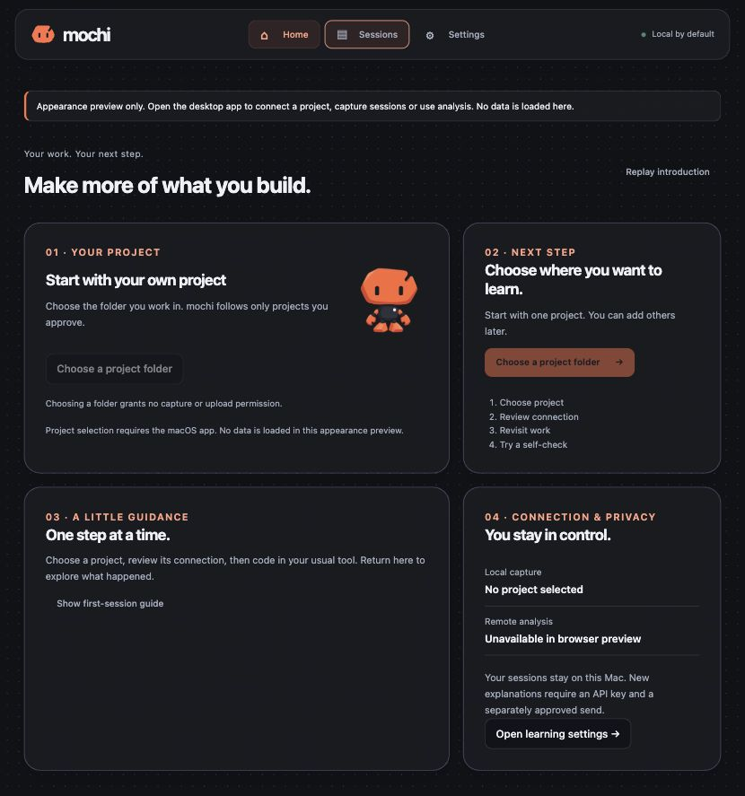
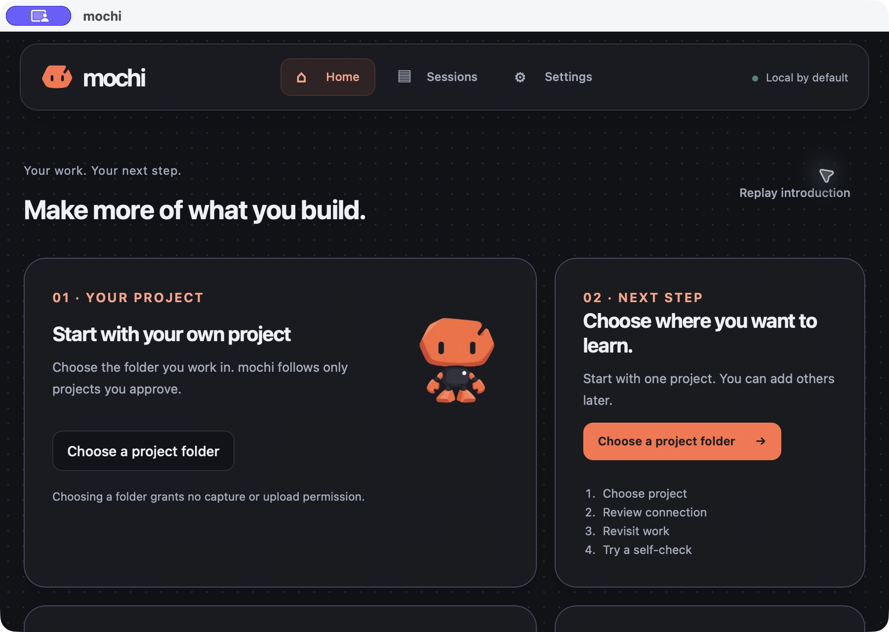
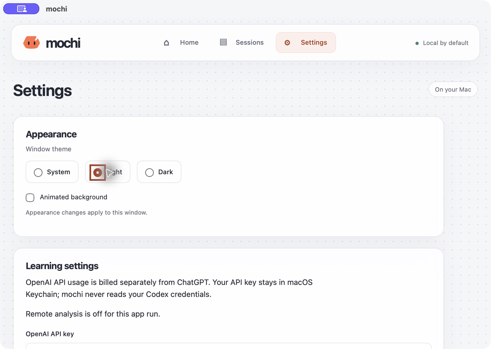

# Shared DotField background trial - 2026-10-03

The user supplied the React Bits DotField component and requested a trial
throughout mochi after Bento Home. [Assigned brief](BRIEF_DOT_FIELD.md).
The main window now uses one shared DotField behind Welcome, all four manual
introduction slides, Home, Sessions and Settings. The separate transparent
companion keeps its own character-only presentation.

## Rendering and accessibility

`background/DotField.tsx` adapts the supplied default bulge variant to strict
TypeScript. Small lavender dots, a brief cursor displacement and a soft glow
retain the reference appearance. Light colors are muted against the paper base;
glass surfaces, orange Signal branding and near-opaque code fields remain.
Sparkles, waves and the alternate spring variant were disabled in the supplied
default and are not added. No dependency, permission, IPC or persisted setting
is introduced. Attribution is included in THIRD_PARTY_NOTICES.md and the app.

Canvas 2D draws a batched path with a cached gradient. It draws once at rest,
then schedules one pointer-triggered RAF chain at at most 30 drawing frames per
second. Motion decays; the chain stops once settled and has a five-second cutoff
after the last pointer event. There is no speed polling interval. Dot count is
bounded to 10,000, backbuffer area to four million pixels, each dimension to
4096 pixels and scale to 1.5. Large displays increase spacing. Resize replaces
the grid; zero-size surfaces cancel pending work and release the backbuffer.
Pointer-at-dot-center arithmetic stays finite. Touch input does not animate.

Animated background remains a window-local switch. Off, reduced motion or an
inactive window uses static CSS dots without allocating an active context or
pointer listeners. Forced colors removes the decoration. Context unavailability,
context loss or drawing failure returns to static dots and releases pending
work. Every lifecycle cleanup cancels RAF, disconnects resize observation and
removes listeners. Decoration has `aria-hidden`, no focus stops and
`pointer-events: none`; it cannot intercept a control. Media and activity
subscriptions remain shared with the existing accessibility handling.

The prior Liquid Ether source/tests and its pinned Three.js dependency remain
as earlier trial material; the active Vite output no longer contains the lazy
Three.js/simulation chunk. The main JS output was 237.24 kB / 74.54 kB gzip at
this checkpoint. Capture, analysis, privacy and draft contracts are unchanged.

## Validation

All nine repository gates passed on macOS Apple Silicon: `pnpm typecheck`,
`pnpm lint:frontend`, `pnpm test:frontend`, `pnpm build`, `pnpm test`, `pnpm lint`,
`pnpm format:check`, `pnpm check:rust`, `pnpm desktop:build`.
The frontend suite has 107 passing tests. Combined Rust tests ran with
`RUST_TEST_THREADS=1` to avoid the previously documented helper-fixture timing
contention; the existing explicitly opt-in Keychain test stays ignored.

New tests cover rest/frame bounds, a pointer exactly on a dot, pause/unmount and
listener cleanup, large/high-density screens, viewport collapse, unavailable
context, drawing failure and context loss. Updated wrapper/App tests cover
focus/visibility, reduced motion, forced colors and the animation switch across
navigation. Existing project-selection, draft, exact-preview and consent tests
continue passing. Native OS reduced-motion/forced-colors changes were not applied
to the user's global settings; those transitions have automated coverage.

An isolated native bundle (`dev.mochi.dotfieldqa20261003`) was built and opened
with an empty profile at 900 x 640 points. Welcome, the manual introduction,
Skip tour, Home, Sessions and Settings all remained usable over the dots.
Keyboard Tab on the introduction showed the existing focus ring. Light/dark
choices and animation off/on worked; off retained static dots. A real quit and
relaunch returned to Home with the dot background and the default system
appearance. No project approval, hook installation, API key or analysis was
performed. Native screenshots below are presentation evidence, not a live
capture/model gate. The test app was closed after verification.

Browser appearance remained explicitly labelled with native actions disabled.
Light/dark Home was checked; at the narrow viewport override (640 requested,
533 CSS pixels at the existing browser zoom) all four cards shared one column
and document scroll width equalled client width. The temporary viewport override
was reset. The final default native bundle is `target/release/bundle/macos/mochi.app`.

| Browser appearance preview, dark | Browser appearance preview, light |
| --- | --- |
|  |  |

| Native minimum-width Home | Native static background setting |
| --- | --- |
|  |  |

[Native light Home](assets/dotfield-native-light.jpg) and
[native light Sessions](assets/dotfield-native-sessions.jpg) record the other
main-window views. This trial does not complete future compatibility, learning
quality, commercial, clean-machine or external release gates.

## Exact pushed source verification

The source push excludes the separate capture-normalization, business and promo
changes. Its isolated Git-index export passed 107 frontend and 147 Rust tests
(one existing Keychain test ignored), strict TypeScript, ESLint, formatting,
Clippy and cargo check. The native build from the same export passed using existing
installed dependencies through direct tools; pnpm's temporary-directory
dependency auto-install was deliberately avoided. The nine pnpm gates above
record the shared working-tree checkpoint, while this additional check verifies
the narrower source being published. No user working files were discarded.
