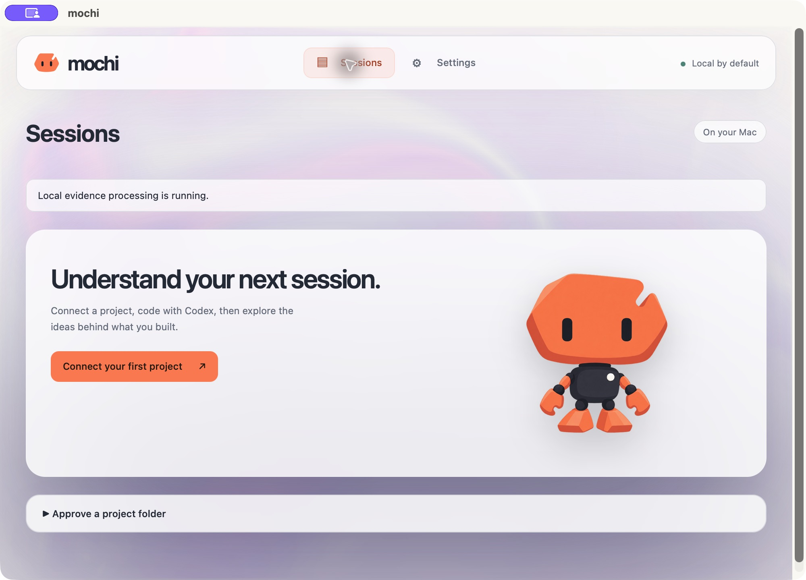
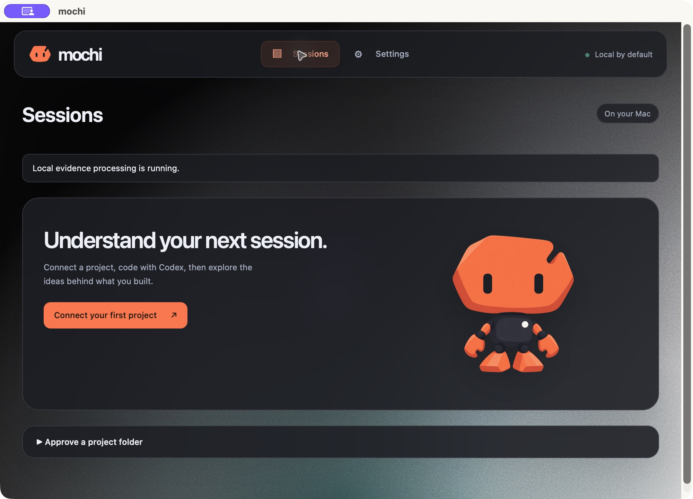
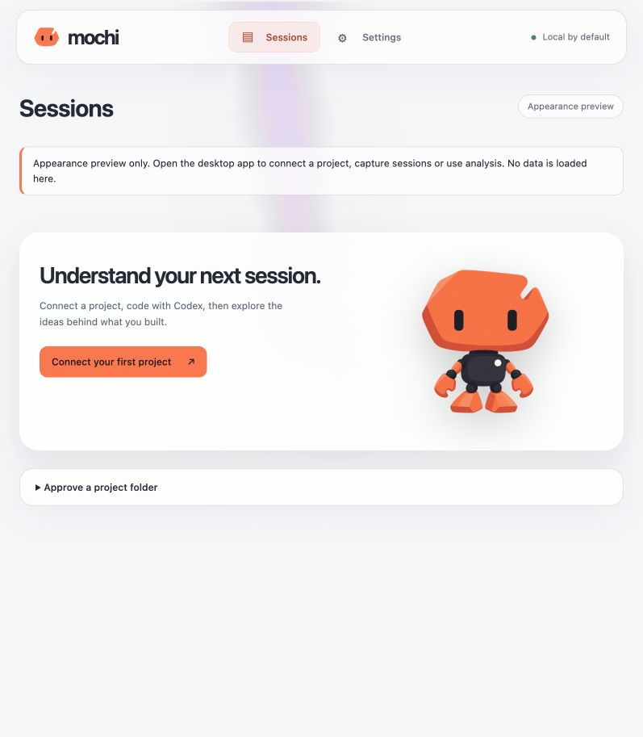
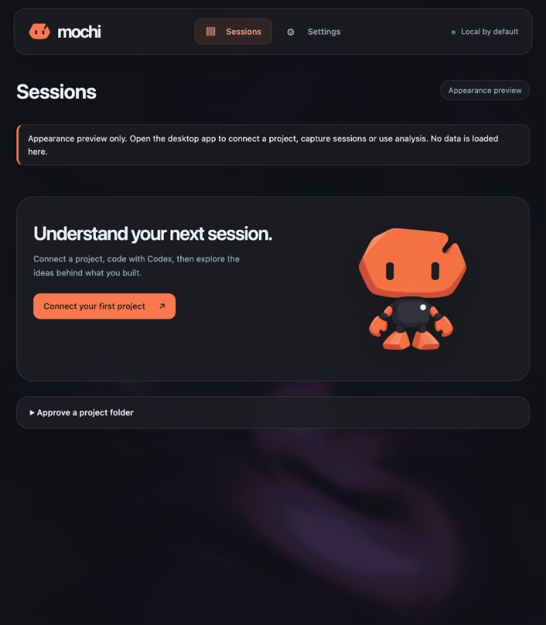

# Personal MVP — aura UI trial

Checkpoint: 2026-10-02. Scope: [bounded brief](BRIEF_UI_AURA_TRIAL.md).
This is a visual trial of the implemented personal CLI MVP, not a new learning
stage, accepted live-provider trial or external distribution release.

## Presentation

The user's follow-up removes the Silver Mist/Aurora Beams gradients and grain
from the initial trial. Light now uses a solid #f5f6f8 base and dark a solid
#101216 base. The transparent, fixed Liquid Ether layer stays behind the
workspace and never owns input. Signal artwork and orange emphasis remain unchanged;
visible branding is lowercase mochi. Glass surfaces have increased opacity and
code fields have near-opaque backgrounds to preserve contrast.

Liquid Ether replaces the initial Ferrofluid trial at the user's request. The
supplied fluid-advection/divergence/pressure/color shaders are ported to strict
TypeScript with Three.js 0.186.1 and development-only @types/three 0.186.0. The
internal interface deliberately exposes only theme/activity, using the requested
preset: purple/pink/lilac palette, mouse force 15, cursor size 75, BFECC enabled,
viscosity/bounce disabled, timestep 0.014, 25 pressure iterations, resolution 0.5
and idle movement speed/intensity 0.5/2.2. Pointer takeover takes 0.25 seconds;
auto movement resumes after 3 seconds with a 0.6-second ramp. A passive pointer
listener never owns or suppresses workspace input. No unused configurable
viscosity/bounce API is exposed.

The transparent effect uses 22% layer opacity in light mode and 32% in dark
mode. Simulation targets are half-float, at most 262,144 pixels each and 768
pixels on either axis. All five targets, six materials/geometries and the
palette are explicitly disposed, including initialization/render/context-loss
failures. Renderer resolution caps at 1.5 DPR. Unsupported float targets fall
back to the solid theme base.

The loop draws at most 30 FPS and caps DPR at 1.5. Blur/hidden-document state
cancels pending frames; reduced motion or forced colors removes the effect.
Switching off Animated background removes the GPU component entirely. Theme and
animation choices last only for this window; system theme changes are observed.
WebGL creation/shader/render/context-loss failures leave the solid theme base, and
unmount removes listeners/observers/buffers and releases the context. No remote
assets, new native permission or CSP relaxation is used. Notices are retained in
[THIRD_PARTY_NOTICES.md](../../THIRD_PARTY_NOTICES.md) and bundled with the app.

A sticky, rounded glass header replaces the fixed left rail, with the mochi
mark, Sessions/Settings navigation and compact local status. Repeated taglines,
empty controls and introductory paragraphs were removed.
Project controls are compact; connection details/disconnect, provider details
and About & diagnostics are expandable. Existing explanation/self-check appears
before expandable Activity and Code context. Evidence links reveal and focus the
retained source. Root/connection approval, ongoing capture while closed, exact
send/cost/provider-retention disclosure and deletion limits remain at their
actions. Session drafts and exact previews stay mounted through navigation.

## Native prerequisite correction

The first GitHub native run failed because target/release/mochi-hook did not
exist before cargo check's Tauri resource validation. prepare:native now builds
both hook profiles and runs before workspace Rust checking/testing/linting and
Tauri development/build. Debug runtime uses its sibling helper; release uses the
bundled resource. There is no placeholder, ignored resource or weakened check.

## Verification

The initial Liquid Ether/header checkpoint passed all nine repository gates on macOS Apple Silicon: `pnpm typecheck`,
`pnpm lint:frontend`, `pnpm test:frontend`, `pnpm build`, `pnpm test`, `pnpm lint`,
`pnpm format:check`, `pnpm check:rust`, and `pnpm desktop:build`. The complete
suite passed 56 frontend and 144 Rust tests; one native Keychain fixture remains
intentionally ignored. The final test-only type-import correction also passed
its two focused simulation tests and the complete lint gate.

Regression coverage checks drafts/exact previews, default-off capture/send
approval, browser isolation, evidence disclosure/focus, live system appearance
and reduced motion, GPU failure, early unmount, frame throttling, focus/visibility
pause and full resource disposal. Browser inspection confirmed light/dark theme
switching, the animation switch removing the canvas, disabled native controls,
no horizontal overflow at the narrow preview size and no console errors.

Native light/dark presentation and keyboard field navigation were inspected in an
empty, separately identified debug test application (`dev.mochi.uiqa.aura20261002`),
without approving any project, enabling remote permission, storing a credential
or sending content. This QA bundle uses the production assets/configuration plus
a debug sibling helper for the debug resolver; the release application separately
built successfully with its helper and third-party notices in Contents/Resources.
Initial gradient-trial native screenshots retain the macOS title/capture indicator
and are historical evidence, before the solid-base follow-up:

| Light | Dark |
| --- | --- |
|  |  |

The release test build is `target/release/bundle/macos/mochi.app`.
The local appearance preview is `http://127.0.0.1:1420/`; it has no native authority.
The separate QA profile is test-only and does not replace the real integration
or clean-machine acceptance gate. No system accessibility setting was changed;
reduced motion and WebGL failure were exercised through deterministic fixtures.
Long source text retains wrapped, independently scrollable near-opaque code
surfaces; no new real captured session was used for this presentation trial.

A source-only isolated copy began without a target directory. Both debug/release
helper preparation and workspace cargo checking passed there, demonstrating the
clean-build prerequisite fix. These results are local validation; GitHub CI status is tracked separately after publication.
Two earlier Rust runs encountered the already documented intermittent installer
fixture HelperUnavailable failure under concurrent build activity. Focused and
isolated integration suites, followed by the complete ordinary suite, passed;
no fixture timeout, production deadline or test exclusion was changed. The
intermittent failure is not claimed fixed by this UI change.

Vite retains a size warning for the 531 kB minified Three.js/simulation chunk
(133 kB gzip). It is loaded lazily only while the GPU background is mounted;
the main application chunk is 41 kB. The warning is not suppressed.
The complete new live CLI/BYOK trial and human quality/cost assessment remain
pending as documented in [INTERNAL_CLI_MVP.md](INTERNAL_CLI_MVP.md). This update
adds no summary mode, historical transcript import, ready lesson or learning
state transition.

## Solid-base follow-up — 2026-10-02

At the user's request, the static gradients and grain were removed, including
the unused SVG asset and responsive blur rules. Light uses #f5f6f8 and dark
#101216. The optional Liquid Ether, glass header/surfaces and accessibility
controls remain. Disabling animation leaves a completely solid background.
Header margins are contained so the theme base reaches the top window edge.
No native, consent, schema or provider behavior changed.

The follow-up passed all 56 frontend tests, frontend lint, strict type checking
and frontend build (via desktop:build), format:check and the macOS application
build. Unchanged Rust behavior was not retested for this presentation-only
follow-up; the prior full-suite result above remains the Rust checkpoint.
Both themes were visually inspected in the labelled browser preview; updated
screenshots below supersede the initial gradient screenshots. The current
release test bundle contains these solid-base assets.

| Light | Dark |
| --- | --- |
|  |  |
